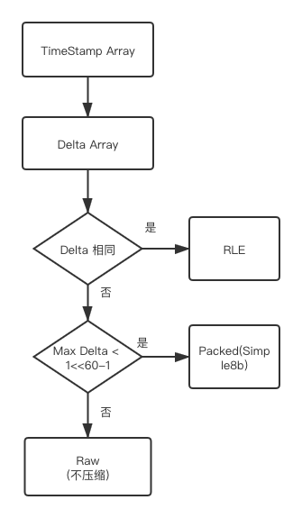

#### Timestamp 压缩

在InfluxDB中数据的压缩主要体现在两个方面，分别是时间戳和Field Value，通过TSM文件的存储我们知道相同的Series Key对应的时间戳和Field value是聚集放在一起的，格式如下：

|   CRC   | FieldValueType | TimeStamp Size | TimeStamps | values |
| :-----: | :------------: | :------------: | :--------: | :----: |
| 4 bytes |    1 bytes     |     N byte     |   N byte   | N byte |

TimeStamps和values都是压缩后的数据块，先来看时间戳的压缩，时间戳目前有两种压缩方式分别是Run-Length-Encoding(RLE)和Simple8b，还有可能不压缩。所以TimeStamps的存储结构就有三种可能，通过前4bit来表示它属于存储方式。具体使用那种方式取决书时间数据的特点，判断逻辑如下图所示



图中的Delta是取的差值，比如数组长度为n，从数据尾部开始，后一个减去前一个元素的差值存放在替换后一个原来的值，直到第一个元素。差值有n-1个，然后判断这n-1个差值是否全部相同，如果相同采用压缩效率最高的RLE，如果最大的差值小于(1<<60) - 1，采用simple8b压缩，至于为什么这个数，后面解释。如果大于则压缩，将每个时间数据都按8byte存。

RLE

如果所有的差值都相同，那么采用TLE方式编码，存储格式如下：

| Encode Type | Divisor | First Timestamp | DeltaValue | N     |
| ----------- | ------- | --------------- | ---------- | ----- |
| 4 bit       | 4 bit   | 8 byte          | 8 byte     | 8byte |

- Encode Type表示编码方式，这里是2

- Divisor意思是是除数的log10的值，采用4bit存储。差值都为1000000，那么Divisor存储的值为6

- First Timestamp就是第一个时间戳的值

- DeltaValue为差值

- N表示有多少个差值

Packed编码

差值数组中数据的最大值不大于（1 << 60）- 1 。使用该算法进行编码时，其存储结构如下：

| Encode Type | Divisor | First Timestamp | Simple8bData |
| ----------- | ------- | --------------- | ------------ |
| 4 bit       | 4 bit   | 8 byte          | -            |

前三个字段的意思与RLE相同，不过Encode Type具体的值为1，接下来看下Simple8b的压缩方式是将多个小与(1<<60)-1的整数压缩到一个64位的整数中，它是根据整数集合的特点来决定如何压缩，共有16种压缩方式，具体如下

```
 ┌──────────────┬─────────────────────────────────────────────────────────────┐
 │   Selector   │       0    1   2   3   4   5   6   7  8  9  0 11 12 13 14 15│
 ├──────────────┼─────────────────────────────────────────────────────────────┤
 │     Bits     │       0    0   1   2   3   4   5   6  7  8 10 12 15 20 30 60│
 ├──────────────┼─────────────────────────────────────────────────────────────┤
 │      N       │     240  120  60  30  20  15  12  10  8  7  6  5  4  3  2  1│
 ├──────────────┼─────────────────────────────────────────────────────────────┤
 │   Wasted Bits│      60   60   0   0   0   0  12   0  4  4  0  0  0  0  0  0│
 └──────────────┴─────────────────────────────────────────────────────────────┘
```

1. 给以一个整数集合，Simple8b从 从 0 到 15 ，依次检查是否满足压缩条件
2. 如果符合某种被压缩，则使用对应规则执行压缩过程，将Selector编号写入目标数组，接着将对应的N个整数写入对应的bits中。
3. 将剩余未压缩数组从步骤1开始继续执行，直到集合中的数据全部被压缩

为什么只有小于(1<<60)-1的整数才能使用Simple8b编码呢？因为编码的后64位前4位要存放Selector，

如果你想知道跟多细节，可以[点这里](https://github.com/jwilder/encoding/tree/master/simple8b)了解go的实现以及测试代码

Raw编码

这种编码方式未对数据进行压缩，为了保持格式一致，还多了一个byte存放Encode Type，存储结构如下：

| Encode Type   | TimeData |
| ------------- | -------- |
| 1byte(高四位) | 8*N byte |

这里的每个时间戳都适用8byte来存储。

以上是Influxdb目前所有实现了对时间戳压缩的方式，但是在文档中提到了考虑未来实现PFOR压缩。

#### 整数(64位)压缩

在Inlfuxdb中只有一种整数类型即int64，现将所有整数通过zigzag转换为正整数。zigzag相当于把符号位放在了最低位，从而有利于小整数的压缩。zigzag编码操作为(n << 1) ^ (n >> 63)，如果zigzag编码后的值都小于(1 << 60) - 1),那么采用Simple-8b压缩，如果有些值大于(1 << 60) - 1)，那么不进行压缩该块。如果所有的值都相同采用RLE编码。和时间戳的压缩的存储格式类似，数据块的前4bit位压缩方式，第二个字节开始存放数据。

#### Float 压缩

FLoat类型使用[Facebook Gorillal](http://www.vldb.org/pvldb/vol8/p1816-teller.pdf)的实现XOR算法进行编码，大致如下：

1. 第一个Value存储时不做任何压缩。

2. 后面产生的每一个Value与前一个Value计算异或值

   如果XOR值为0，即两个Value相同，那么存为0，只占用一个bit。

   如果XOR为非0，那么第一个bit存为1，计算XOR中位于**前端**的和**后端**的0的个数，即Leading Zeros与Trailing Zeros。

   - 如果Leading Zeros与Trailing Zeros与前一个XOR值相同，则第2个bit值存为’0’，紧跟着去掉Leading Zeros与Trailing Zeros以后，只存有效XOR值部分。

   **2.1)** 如果Leading Zeros与Trailing Zeros与前一个XOR值相同，则第2个bit值存为’0’，而后，紧跟着去掉Leading Zeros与Trailing Zeros以后的**有效XOR值**部分。

    Leading Zeros与Trailing Zeros与前一个XOR值不同，则第2个bit值存为’1’，紧跟着5个bits用来描述Leading Zeros的值，再用6个bits来描述**有效XOR值**的长度，最后再存储**有效XOR值**部分。

