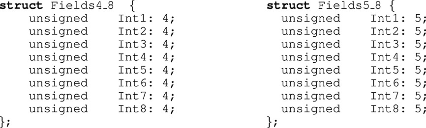

#### 
Decoding billions of integers per second through vectorization

D. Lemire and L. Boytsov

LICEF Research Center, TELUQ, Montreal, QC, Canada

Carnegie Mellon University, Pittsburgh, PA, USA

### 摘要 

在许多重要的应用程序例如搜索引擎和关系数据库系统中，数据以整数数组的形式存储。对这些数组进行编码，最重要的是解码会消耗大量的CPU时间。因此研究人员已经做出了巨大的努力来减少与压缩和减压相关的成本，特别的是已经开发出超标量的现代处理器和单指令多数据(SIMD)指令集。我们引入了一种新的向量化方案SIMD-BP128*，这比以前提出的向量化方法有所改进。它的速度几乎是varint-G8IU和PFOR在台式机处理器上最快的方案的两倍，同时SIMD- BP128*每个整数最多节省2位。为了获得更好的压缩效果，我们提出了另一种新的向量化方案SIMD-FastPFOR，其压缩率和最新的Simple-8b相比降低10％之内，但是解码速度快了两倍。

**关键字**：性能；测量；索引压缩；向量处理

#### 1. 引言

计算机存储设备是一个层次结构，从慢而便宜（磁盘或磁带）到快而昂贵（寄存器或CPU缓存）。在许多情况下，访问较低层次的存储设备会抑制应用程序性能。 以前只有磁盘和磁带被认为是慢速设备。 因此，应用程序开发人员倾向于仅优化磁盘输入/输出。而如今，CPU变得如此快以至于访问主内存已成为许多工作负载的限制因素[^1][^2] [^3][^4] [^5]。数据压缩可以通过减少主存带宽显著提高查询性能。数据压缩有助于将更多的数据加载并保存到存储器中。因此，快速压缩方案可以提高数据库系统[^6][^7][^8]和文本检索引擎的性能 [^9][^10] [^11][^12][^13]。

我们主要研究32位整数序列的压缩技术。最好是大多数整数都很小，因为我们可以通过更紧凑地表示小整数来节省空间，也就是说使用短代码。假设没有一个值大于255，我们可以使用1个字节对每个整数进行编码，从而实现4的压缩比(整数使用未压缩格式的4个字节)。

在关系数据库系统中，列值通过字典编码转换为整数值[^14][^15] [^16][^17][^18]。为了提高压缩性，我们可以将最频繁的值映射到最小的整数[^19]。在文本检索系统中，单词通常由整数文档标识符的排序列表表示(也称为发布列表)。这些标识符通过数据差分转换为小整数。 其他数据库索引也可以类似地存储[^20]。

数据差分的主流方法是差分编码(图  1)，而不是存储j将原始数组排序后的数据$(x_1 , x_2 , ...$with $x_i <= x_{i+1} $for all $ i )$，我们只保留连续元素之间的差异以及初始值：$(x_1, \delta_2= x_2 -x_1,\delta_3=x_3-x_2, ...)$。差异或增量是非负整数，通常比原始整数小得多， 因此它们可以被更有效地压缩。我们可以通过计算前缀和来重建原始数组$(x_j=x_1 + \sum_{i=2}^j\delta_j)$。差分编码也被称为增量编码[^18],[^21],[^22]，不要与Elias delta编码混淆(2.3节)，差分编码的一个缺点是，随机访问位于给定索引处的整数可能需要对几个增量求和，如果需要，我们可以通过将大型数组划分为较小的数组来缓解此问题。

​	

图 1. 使用差分编码和整数压缩算法对整数数组进行编码和解码。

工程师可能会倾向于使用通用压缩工具，例如LZO，Google Snappy，FastLZ，LZ4或gzip， 然而这可能是不明智的。 我们最快的方案比快速通用库如Snappy快一个数量级，同时压缩效果更(第6.5节)，使用基于单指令多数据（SIMD）操作的专用方案压缩这些整数数组可能更可取。Stepanov et al. [^12]报告说到他们基于SIMD的varint-G8IU算法的性能比经典的可变字节编码方法（[第2.4节]()）高300％，还表明使用SIMD指令可使解码算法的性能提高50％以上。

表 1 中，给出对32位整数最好的解缩速度报告，单位为百万/秒。我们指出作者是否明确使用了单指令、多数据指令。结果不具有直接可比性，但它们说明了性能的演变。

|                                      | Speed    | Cycles/int | Fastest scheme  | Processor           | SIMD  |
| ------------------------------------ | -------- | ---------- | --------------- | ------------------- | ----- |
| **This paper**                       | **2300** | **1.5**    | **SIMD‐BP128*** | Core i7 (3.4 GHz)   | SSE2  |
| Stepanov *et al*. (2011) [^12]       | 1512     | 2.2        | varint‐G8IU     | Xeon (3.3 GHz)      | SSSE3 |
| Anh and Moffat (2010) [^23]          | 1030     | 2.3        | binary packing  | Xeon (2.33 GHz)     | no    |
| Silvestri and Venturini (2010) [^24] | 835      | —          | VSEncoding      | Xeon                | no    |
| Yan *et al*. (2009) [^10]            | 1120     | 2.4        | NewPFD          | Core 2 (2.66 GHz)   | no    |
| Zhang *et al*. (2008)[^25]           | 890      | 3.6        | PFOR2008        | Pentium 4 (3.2 GHz) | no    |
| Zukowski *et al*. (2006) [^26]       | 1024     | 2.9        | PFOR            | Pentium 4 (3 GHz)   | no    |

> SIMD，单指令多数据； SSE2，单指令多数据流技术扩展 2； SSSE3，单指令多数据流技术扩展 3。

我们以保守的方式报告自己的速度，(1) 我们的计时基于挂钟时间，而不是常用的CPU时间；(2) 我们的计时包括所有的解码操作，包括前缀和的计算，而其他作者[^24]会省略它；(3) 我们报告的基于真实数据可以达到每秒23亿个整数的速度，另外测量一些真实数据的速度甚至达到了25亿以及28亿。

从表 1我们可以看到的另一个结论是，并不是所有的作者都选择使用SIMD指令，尽管PFOR [^26]有几种变体，例如NewPFD和OptPFD [^10]，自Pentium 4和SSE2推出以来，我们首次引入了一种变体，旨在利用可用的向量化指令。 实验结果表明，这种向量化是必要的，我们的SIMD-FastPFOR方案比PFOR的解码速度至少高出30％，同时提供了出色的压缩率$(10％)$。 在一些情况下，SIMD-FastPFOR 是原始PFOR的两倍。

对于大多数方案，前缀总和计算是如此之快，以至于只占运行时间的20％或更少。 但是由于我们的新颖方案要快得多，因此前缀和可以占运行时间的大部分。因此我们不得不尝试更快的替代方法。 我们发现使用SIMD指令的向量化前缀总和可以快两倍。 没有向量化差分编码，我们将无法达到每秒20亿个整数的速度。

从某种意义上说，我们获得的速度提升是直接将高级硬件指令应用于整数编码问题（特别是2001年推出的SSE2）。 但是，说明如何执行此操作并量化所产生的收益是很有启发性的。

### 2 相关工作
一些最早的整数压缩技术有Golomb coding [^27]，Rice coding [^28]以及Elias gamma和delta coding[^29]。 近年来已经添加了几种更快的技术，例如Simple系列，binary packing和patched coding。 我们简要回顾一下。

因为我们使用无符号整数，所以我们使用两种表示形式：二进制和一元编码。在这两个系统中，数字仅使用两位数字表示：0和1。二进制表示法是标准的位置以2为基的系统（例如1→1、2→10、3→11）。给定正整数*x*，二进制表示法要求$log_2（x + 1）$位。计算机通常通过将前导零加到固定的位数来使用二进制数存储无符号整数，例如，使用8位将3写入00000011。用一元编码表示法，我们将数字*x*表示为$x − 1$个0的序列，后跟数字1（例如1→1、2→01、3→001）[^30]。如果数*x*可以为零，我们可以存储*x* +1。

#### 2.1 Golomb和Rice编码

在Golomb编码中，给定一个固定参数*b*和一个正整数*v*被压缩$v/b$的商使用一元编码，余数r=v % b​使用二进制编码，当*b*选择为2的幂时，所得算法称为Ricecoding。可以通过假设整数遵循已知分布来最佳地选择参数*b*[^27]。

不幸的是，Golomb和Rice要比variable byte[^9][^10][^31][2.4节]()，达不到我们每秒解码数十亿个整数的目标。

#### 2.2. Interpolative coding

如果速度不是问题，但是希望对排序后的数组进行高压缩，则Interpolative coding[^32]可能会很有吸引力。在此方案中，我们首先以最小的形式存储最小值和最大值$x_1$和$x_n$。然后将中间的值以二进制形式存储，这是因为该值必一定*x* 1，*x* *n*）范围内。如果$x_1 = 16$且$x _n$ = 31，我们知道对于*x*之间的任何值，差$x−x_1$是从0到15。因此，我们可以仅使用4位对这种差异进行编码。然后递归地重复该技术。不幸的是它比Golomb编码还慢[^9][^10]。

##### 2.3. Elias gamma and delta coding

一个Elias gamma码[][][^29][^30][^33]有两部分组成，第一部分以一元编码，即以二进制$log_2（x + 1)$存储正整数所需的最少位数。 第二部分以二进制表示形式的整数去除最高有效位。 如果整数等于1，则第二部分为空（例如1→1、2→01 0、3→01 1、4→001 00、5→001 01）。如果整数可以为零，我们可以将其值编码为+1。

随着数字变大，Elias gamma coding变得低效。 为了更好地压缩，Elias delta对Elias gamma的第一部分的数字在进行一次Elias gamma ，而第二部分则采用二进制表示法进行编码。 例如要使用Elias delta码对数字8进行编码，我们首先将4 =$log_2（8 + 1）$存储为001 00，然后我们可以存储除最高有效位以外的所有位。 最终结果为001 00 000。

然而variable  byte的速度是Elias gamma和delta的两倍[^24]。Golomb和Elias gamma无法达到我们每秒压缩数十亿个整数的目标。

##### 2.3.1 k-gamma

#### 2.4 可变字节和面向字节的编码
可变字节是一种流行的技术[^35]，它以许多名称（v-byte, variable-byte [^36], var-byte, vbyte [^30], varint, VInt, VB [^12], 以及Escaping [^31]）。据我们所知，由Thiel 和 Heaps在1972年首次提出的[^37]。可变字节以字节为单位对数据进行编码：它使用低7位存储数据，而第八位用作代码长度的隐式指示。例如

- $[0,2^7)$中的整数使用1个字节写入，低7位用于存储整数的二进制表示，第八位设置为0。

- 在整数$[2^7，2^{14})$，使用2个字节写入，第一个字节的8位被设置为2，而第二个字节的第八个bit置为0，其余的14位被用于存储二进制整数的表示形式。

举一个具体的例子，数字200以二进制表示法写为11001000。可变字节将使用16位将其编码为1 0000001 0 1001000。解码时，字节依次读取：如果第八位为1，则丢弃该第八位；每当第八位为0时，我们就输出一个新的整数。

尽管可变字节很少能最佳地压缩数据，但它相当有效。在我们的测试中，可变字节编码数据的速度是大多数替代方法的三倍。此外当数据不可高度压缩时，它可以匹配更简约方案的压缩率。

Stepanov et al.[^12]将可变字节编码概括为一系列面向字节的编码。 它们的主要特征是整数中的一个字节中的bits仅来自一个整数， 当可变字节每字节使用1位作为描述符时，有替代方案例如，varint-G8IU[^12]和varint-GB[^13]将所有描述符重组为一个字节。 这样的替代布局使得同时解码多个整数更加容易。一种类似的将描述符放在控制字中的方法被用来加速Lempel-Ziv算法的变体[^38]。

例如varint-GB使用一个字节描述4个整数，一个整数使用2bit来表示。假设我们要存储整数$2^{15}，2^{23}，2^7$和$2^{31}$。在通常的二进制表示法中，我们将分别使用2、3、1和4个字节。如果我们假设每个数字都是使用非零字节数编码的，那么我们可以将序列存储为1、2、0、3。这4个整数中的每一个都可以使用2位来写入。我们可以将它们打包成一个字节01、10、00和11。在此字节之后，我们使用$2 + 3 + 1 + 4 = 10$个字节写入整数值。

varint-GB使用单个描述符对4个整数进行编码，而varint-G8IU对8 byte使用一个描述符，这8个字节组可以存储2到8个整数。1 byte的描述符放在8 byte前面，每当描述符位设置为0时，相应的字节就是整数的结尾。比如四个整数$2^{15}、2^{23}、2^7$和$2^{31}$，只能将前三个整数存储到单个8字节组中，这些整数分别使用2、3和1个字节，描述符字节以二进制表示为11001101。描述符的前两位（01）告诉我们，第一个整数使用2个字节。接下来的三位（011）表示第二个整数需要3个字节。由于第三个整数使用单个字节，因此描述符的下一个位将为0。在此模型中无法使用后两个字节，因此我们将后两位设置为1。

在最新的x86处理器上，可以使用SSSE3混选指令pshufb有效地解压varint-G8IU压缩的整数。此操作选择性的将源16 byte向量复制到目标16 byte缓冲区的指定位置，并将选定的元素替换为零。混选(shuffle)这个名称用词不当，因为某些源字节可以省略，而一些源字节可以多次复制到多个不同的位置。该操作采用两个16向量（16×8位＝ 128位），第一个向量的字节将被混选到输出向量，而第二个向量用作混选掩码。混选掩码中的每个字节确定源向量中的一个值将输出到目标向量中的相应位置。如果该位置字节的值大于127，则目标字节的对应位置将置零。

在图2中，我们说明了varint-G8IU的解码算法的一个步骤。我们假定已经检索了描述符字节，该描述符字节存储三个整数$2^{15}、2^{23}、2^7$所需的2、3、1进行了编码。描述符字节用于为pshufb获得适当的混选掩码。该掩码定义了编码的操作序列，该操作序列将字节从源复制到目标缓冲区，或用零填充目标特定的缓冲区字节。所有这些字节操作都以以下方式并行执行

- 第一个整数使用2个字节，这两个字节均被复制到目标缓冲区的0-1字节。目标缓冲区的2–3字节被置零。

- 同样，我们将源缓冲区的字节2–4复制到目标缓冲区的4–6字节。目标缓冲区的7字节被置零。

- 最后一个整数仅使用一个5字节，我们将此字节的值复制到8字节，9-11字节置零。

- 目标缓冲区的字节12-15当前未使用，将由后续的解码步骤填充。在当前步骤中，我们可以使用任意值

图 2. 使用混选指令同时解码方案varint-G8IU中的三个整数的示例。 整数$2^{15}、2^{23}和2^7$被压缩到8字节的块中，其中2字节未使用。 字节值由十六进制数展示，源16字节缓冲区复制目标16字节缓冲区或将其填充为零。 箭头指示将源缓冲区的哪些字节复制到目标缓冲区，以及它们在源缓冲区和目标缓冲区中的位置。

我们不知道Google是否使用SIMD指令实现了varint-GB[^13]。但是，Schlegel等[^34]和Popov[^11]描述了pshufb指令加速varint-GB方案的解码的方案，Schlegel等人将其称 four‐wise null suppression。

Stepanov等[^12]发现varint-G8IU的压缩比基于SIMD的varint-GB速度快20％。 与普通可变字节相比varint-G8IU的压缩率稍差10％，但快了2-3倍。

####2.5 Simple系列

可变字节采用固定的输入长度并产生可变长度的输出，而Simple系列在每一步都输出固定数量的bit来处理不定长输入。但是与varint-G8IU不同，Simple系列的方案不是面向字节的。它们可能在高度可压缩的数组上表现更好。例如它们可以将{0,1}中的数字序列压缩为1bit / int。

64位处理器上最有竞争力的简单方案是Simple-8b [^23]。它输出64位，每个64位的前4位是用于指示编码的模式选择器。其余的60位用于保留数据。每个整数使用相同数量的位*b*来存储。Simple-8b有两种编码零序列的方案和14种编码正整数序列的方案。例如：

- 选择器0或1分别代表包含240和120个零的序列。在这种情况下，将忽略60个数据位。
- 选择器2对应于*b* =1。这使我们可以存储60个{0,1}整数，这些整数压缩在一个bit中
- 选择器3对应于*b* = 2，并允许将30个[0,3]的整数，每个整数放入2个bit

依此类推见表  2，选择器的值越大，*b*越大，60个位容纳的整数越少。在编码过程中，我们会依次尝试从值0开始的选择器。也就是说我们会贪婪地尝试在下一个64位字中容纳尽可能多的整数。

表2. Simple-8b方案的编码模式。1个到240个整数用一个64位字编码。

| Selector value |  0   |  1   |  2   |  3   |  4   |  5   |  6   |  7   |  8   |  9   | 10   | 11   | 12   | 13   | 14   | 15   |
| :------------- | :--: | :--: | :--: | :--: | :--: | :--: | :--: | :--: | :--: | :--: | :--- | :--- | :--- | :--- | :--- | :--- |
| Integers coded | 240  | 120  |  60  |  30  |  20  |  15  |  12  |  10  |  8   |  7   | 6    | 5    | 4    | 3    | 2    | 1    |
| Bits/int       |  0   |  0   |  1   |  2   |  3   |  4   |  5   |  6   |  7   |  8   | 10   | 12   | 15   | 20   | 30   | 60   |

比如其他方案Simple-9[^9]和Simple-16[^10]使用32位。尽管这些方案有时可能会压缩得更好，但它们通常较慢。因此我们在实验中省略了它们。与Simple-8b可以在$[0,2^{60}）$中编码整数不同，Simple-9和Simple-16被限制为$[0,2^{28}）$中的整数。

尽管Simple-8b在编码过程中不如可变字节快，但仍比许多替代方法快。因为可以高效地执行解码步骤在获得比可变字节更好的压缩率的同时，我们还可以获得良好的解码速度。

#### 2.6 Binary packing

 Binary packing与来自 Goldstein et al. [^39]的frame‐of‐reference (FOR)以及来自Ng 和 Ravishankar [^40]的tuple differential coding技术密切相关。

 在Binary packing中，大整数数组被划分为块（如128个整数位一个块）。 首先计算块中的值范围，然后参考值的范围写入块中的所有值。如果块中的值是[1000,1127]范围内的整数，则它们可以对每个整数使用7个bit进行编码($log_2（1127 + 1 − 1000）= 7$)，存储的每个值与1000的偏移量。此外还需要存储块长度、7和1000用于解码。

Anh和Moffat称Binary packing为Packed Binary[^23]，而Delbru *等人*[^41]称128‐integer binary packing FOR 和 32‐integer binary‐packing AFOR‐1

 #### 2.7 变长的Binary packing 

确定Binary packing 的存储成本有三个因素：

- 以二进制表示法存储最大数值所需的位数b，

- 块长度B

- 每块的固定开销 κ。

一个块的总存储成本为*bB* +  *κ*。Binary packing使用固定长度的块如*B* = 32或*B* = 128。我们可以动态改变块的长度以提高压缩率。这给每个块增加了很小的开销，因为我们不仅需要存储相应的位宽*b*，还需要存储块长度*B*。

选择动态块长度的首先由Deveaux等人[^42]提出。  他们使用了自上而下和自下而上的启发式方法压缩率提升了(15–30)％

#### 2.8  Patched coding

Binary packing 有时可能压缩效果不好。 例如整数1、4、255、4、3、12、101可以使用8位的二进制存储形式存储。 但是具有一个较大值的相同序列例如1、4、255、4、3、12、4294967295不再那么可压缩，至少需要32位/ int。为了解决这个问题，Zukowski等人[^26]提出Patched，我们使用b个bit存储大部分整数，当一些整数大于或等于$2^b$时，把这些异常数存储在单独的位置。他们这种方法为PFOR，当使用差分编码时，也会称为PFD [^43]、PFor或PForDelta。

我们从将输入数组划分为具有固定大小（例如32MB）的子数组开始。将每个这样的子数组称为页。PFOR中的整个页使用一个bit长度即*b*，为了确定编码期间的最佳b，在页外创建最多$2^{16}$个整数的样本。然后测试各种位宽度，直到获得最佳压缩率。在实践中为了加快计算速度，我们可以构建直方图，记录给定整数所需要的位数$（log_2（x + 1））$。

一个页以128个整数的块进行编码，一个页有一个的异常数组。当整数的值为正常的值时，将该值编码为b个bit。如果是异常值时，则将下一个异常值的偏移量写入b个bit。偏移量是下一个异常的索引与当前异常的索引之间的差减一，我们将整数值和偏移量存储在同一数组中。如下列数组：

10, 10, 1, 10, 100110, 10, 1, 11, 10, 100000, 10, 110100...

假设位宽b = 3，那么在位置4,9,11为异常值，偏移量为9-4-1 = 4,11-9-1 = 1。 用二进制表示4→100和1→1，因此我们将存储结果如下

0,10,1,10,100,10,1,11,10,1,10...

在每个压缩的块之前是一个包含两个标记的32位。 第一个标记指示第一个异常在块中的位置，在我们的示例中为4。第二个标记指示该块第一个异常值在异常数组中的位置。

我们首先读取第一个异常的位置， 然后转到该位置找到偏移量，从而可以获取下一个异常的位置。如果位宽b太小而无法存储偏移量值，也就是说，如果偏移量大于或等于$2^b$，则我们额外创建强制的异常来链接异常。

当异常过多时，这些异常表可能会溢出，因此有必要启动新页，Zukowski[^26]使用的页大小为32MB。 在我们自己的实验中，我们将大型数组划长度为$2^{16}$的整数数组（第6.2节），实际我们使用的是单个页。PFOR [^26]不压缩异常值。 为了提高压缩率，Zhang等人[^25]建议使用8位、16位或32位存储异常值。 我们实施了这种方法此后称为PFOR2008）

表3.Patched coding概述，PFOR和PFOR2008强制产生异常，并且每页使用单个位宽b。 NewPFD和OptPFD逐块存储异常。 我们实现了所有方案，每个块具有128个整数，并且页大小至少为$2^{16}$个整数。

|                            | Compulsory | Bit width | Exceptions | Compressed exceptions |
| :------------------------- | :--------: | :-------: | :--------: | :-------------------: |
| PFOR [^26]                 |    Yes     | Per page  |  Per page  |          No           |
| PFOR2008 [^25]             |    Yes     | Per page  |  Per page  |    8, 16, 32 bits     |
| NewPFD/OptPFD [^10]        |     No     | Per block | Per block  |       Simple‐16       |
| FastPFOR [Section 5]       |     No     | Per block |  Per page  |    Binary packing     |
| SIMD‐FastPFOR ([Section 5] |     No     | Per block |  Per page  | Vectorized bin. Pack. |
| SimplePFOR [Section 5]     |     No     | Per block |  Per page  |       Simple‐8b       |

##### 2.8 1  NewPFD和OptPFD

PFOR和PFOR2008的压缩率相对适中。 我们发现在32个整数的块上，它们的性能比Binary packing差。 为了获得更好的压缩，Yang 等人[^10]提出了两个新方案，称为NewPFD和OptPFD。 NewPFD有时被称为NewPFOR 44/45，而OptPFD也被称为OPT-P4D24。它们不是使用每页相同的位宽b，而是使用每块(128个整数)相同的位宽。 避免强制性异常的浪费，也是将异常偏移量存储在块中，而是存储异常整数值的低b位。 给定以下数组：

10, 10, 1, 10, 100110, 10, 1, 11, 10, 100000, 10, 110100...

并且宽度b为3，将压缩为：

10,10,1,10,110,10,1,11,10,0,10,100...

异常值的高32-b位，即在示例中为100,100,110...以及它们的位置放入异常数组中，并使用Simple-16压缩。每个块前面都有一个32位，用于存储位宽b、异常数和异常数据压缩后的长度。NewPFD通过以使不超过10％的整数为异常的方式来决定b，OptPFD选择b的值以最大化压缩率。 为了加快处理速度，建议在0-16、20和32的整数值中选择位宽。

Ao 等人[^43]也提出了一个称为ParaPFD的PFOR版本。 尽管它的压缩效率比NewPFD或PFOR差，但它是为在图形处理单元上快速执行而设计的。 

### 3. 快速差分编码和解码

我们认为所有方案在实验上都基于32位无符号整数的差分编码。 差异或增量的计算通常被认为是微不足道的操作，其仅占总解码时间的可忽略部分。 因此作者没有讨论它。 但是根据我们的经验，差分解码的直接实现可能比小整数的解压缩慢四倍。

我们已经实现并评估了两种差分的方法：

1. 标准形式的差分编码很简单，在编码过程中每个值仅需一个减法$（δ_i= x_i-x_{i-1}）$，在解码期间每个值只需一个加法即可有效地计算前缀和$（x_i =δ_i+ x_{i-1}）$。
2. 向量化的差分编码使前四个元素保持不变。对剩余每个元素索引为$i$，减去索引为$i-4$的元素：$δ_i= x_i-x_{i-4}$。换句话说，原始数组$（x_1,x_2,...）$转换为$（x_1,x_2,x_3，x_4,δ_5= x_5-x_1,δ_6= x_6-x_2,δ_7= x_7-x_3,δ_8= x_8-x_4, …）$ 这种方法的优点是我们可以使用一个SIMD操作来计算四个差值。 此操作对两个四个元素的向量执行逐个元素的减法。 解码部分是对称的，$x_i =δ_i+ x_{i-4}$同样，我们可以使用单个SIMD指令同时执行四个加法。

使用标准差分解码，即展开循环计算前缀和。我们可达到20亿个整数/s或1.7cycle / int的速度。同时我们实现了差分编码的向量化版本。速度能达到50亿/s。但是这是有代价的，向量化的差分通常以向前第四个元素进行差分甚至更长。这将导致存储成本平均增加2位（表5）。

为了防止内存带宽成为的瓶颈，我们更喜欢计算差分编码和解码。我们从最大索引开始，以递减的索引顺序计算增量。例如，给定整数1,4,13，我们首先计算13和4之间的差，我们将它们存储在最后一个位置（1,4,9），然后计算4和1之间的差，我们将它们存储在第二个位置（1、3、9）。解码则相反，从数组头部开始，差分解码以递增的顺序进行。从1,3,9开始，我们首先将1和3相加，我们将其存储在第二个位置（1,4,9），然后将4和9相加，我们将其存储在最后一个位置（1,4,13）。我们的实现需要两次遍历：一次通过其压缩格式重建增量，另一次通过计算前缀和（第6.2节）。为了提高数据的局部性并减少高速缓存未命中，将包含超过$2^{16}$个整数$（2^{16}×4B = 256KB）$的数组分解为较小的数组，并分别对每个数组进行解压缩。使用综合数据进行的实验表明，通过分解数组来高速缓存命中，可以在不降低压缩效率的情况下，对某些方案的解码速度进行近乎显着的改善。

### 4. 快速位解包

位打包是在$[0,2^ *b*）$中使用每个*b*位对小整数进行编码的过程，*b*可以是任意的，而不仅仅是8,16,32或64。每个数字都是使用正好是*b* 位写入的。固定大小为*b的*位接在一起成为一个位串，该位串可以跨越多个32位字。如果某个整数太小而无法使用所有*b* 位，则将其填充为零。

诸如C和C ++之类的语言支持通过位字段进行位打包的概念。图3给出了两个具有位字段的C / C ++结构的示例  。本示例中的每个结构都存储八个小整数。结构Fields4_8使用4位/整数（*b* = 4），而结构Fields5_8使用5位/整数（*b* = 5）。

图3. 在C / C ++中，两个结构体有8个整数。左面中的整数使用4位字段，而右面中的整数使用5位字段。

假设这些结构中的位字段紧凑地存储，即没有间隙，并且保留了位字段的顺序，则将八个整数存储在内存中，如图4所示  。如果未使用任何位，则它们的值可以是任意的。图4左面的所有小整数正好是32位字。但是右侧整数需要两个32位字，其中24位仍未使用（这些位可以是任意的）。 第七个整数的字段越过32位的边界：前2位使用第一个单词的30-31位，而其余3位使用第二个单词的0-2位。
图 4.

不幸的是，语言的实现没有要求确保数据全部打包，例如，C语言规范指是将不合适的位字段放入下一单元或者相邻单元重叠[^46]。最重要的是，他们不必提供最佳快速的装箱和拆箱程序。 因此，我们按照Zukowski等人[^26]的建议使用自己的程序实现了位打包和拆包。在图5中，我们假定这些字段的布局如图4所示，给出了此类过程的C / C ++实现，打包过程可以类似地实现，为简化说明起见我们省略了它们

图5通过两个过程来解包八个位打包的整数。 程序unpack4_8适用于b = 4，而程序unpack5_8适用于b = 5。1. 整数紧密堆积，即没有间隙。2.打包表示使用整个32位字，未使用位的值未定义。

在某些情况下，即使某些整数大于$2 b  -1$（第2.8节），我们也使用位打包。实际上我们只打包 这些整数的前b位，这可以通过对每个整数应用掩码$2 b  -1$的逐位逻辑和运算来实现。这些额外的步骤减慢了位打包的速度（第6.3节）。

unpack4_8解码八个4位整数的过程中，由于这些整数紧密包装在一起，因此它们仅占据一个32位字。假设此字已经加载到寄存器中，则最多可以使用四个简单的操作（移位，掩码，存储和指针增量）提取每个整数。拆包很有效，因为它不涉及任何分支。

unpack5_8解码八个5位整数的情况稍微复杂，因为压缩表示形式使用两个单词，第七个整数的字段越过单词边界。此整数的前两个（低）位存储在第一个字中，而其余三个（高）位存储在第二个字中。解码不涉及任何分支，并且大多数整数是使用四个简单的操作提取的。

unpack4_8和unpack5_8只是示例。每个位宽度（不仅是4和5）都需要单独的过程。

unpack4_8和unpack5_8解码在标量32位值上进行，提高解码的性能的有效方法是向量化[^14][^47]。考虑图5中的清单，并假设in和out是指向m组元素向量的指针，而不是标量。假设标量运算符（移位，赋值和按位逻辑运算）已向量化。对所有m组向量元素同时进行逐位移位。 然后一次对unpack5_8或unpack4_8的调用将解码m×8而不是仅解码八个整数。

最近x86处理器已经SIMD上的四个32位整数向量进行操作的指令（m= 4）[^48][^49] [^50]。我们可以使用这些指令来达到更好的解码速度。 图[6]给出了b = 5的 向量化数据布局。整数以循环方式在4个32位字的序列中划分。当一系列四个字溢出时，数据将溢出到下一个32位整数系列中。在此示例中，前24个整数存储在前四个字中，整数25–28的一部分在第一个字系列中，另一部分在第二个字系列中，其余的整数29–32存储在第二个字系列中图[6]的第二行 。注：32位称为一个字(原文用word)。

图6

可以使用unpack5_8的向量化版本来处理这些数据，该过程是通过用相应的SIMD指令替换标量运算获得。借助Microsoft，Intel或GNU GCC编译器，我们几乎可以通过将每个C运算符替换为等效的SSE2内在函数，从标量过程转换为矢量化过程：

- 按位逻辑和（＆）变为_mm_and_si128
- 右移（>>）变为_mm_srli_epi32
- 左移（<<）变为_mm_slli_epi32_

图7.

将图5的过程unpack5_8与图7的过程SIMDunpack5_8进行比较内在函数的作用与C运算符相同。除了它操作4个整数的向量而不是单个整数。例如，函数_mm_srli_epi32一次移位四个整数。函数_mm_load_si128和_mm_store_si128数据从内存加载寄存器和将寄存器的内容写入内存，函数_mm_set1_epi32创建一个由四个整数组成的向量，该向量用一个整数初始化（例如31变为31,31,31,31）。

在向量化过程的开始，指针指向图6中第1行中显示的第一个128位数据块，第一个移位和掩码操作一次提取了四个小整数。 然后使用单个128位SIMD存储操作将这些整数写入目标缓冲区。 重复移位和掩码操作，直到我们提取前24个数字和整数25-28的前两位。 此时增加指针，并将下一个128位块加载到寄存器中。 使用附加的掩码操作，它将提取整数25-28的剩余3位。 这些位与已经获得的前2个位组合（对于每个25-28中的整数）。 最后我们存储整数25-28，并通过提取数字29-32完成对第二个128位块的处理。

我们的向量化数据布局是交错的。也就是说，前四个整数（图6中的Int 1，Int 2，Int 3和Int 4）被打包到四个不同的32位字。第一个整数紧邻第五个整数（Int 5）。 Schlegel等[^34]被称之为垂直模型。同样我们可以将整数按顺序打包的，比如Int1,Int 2,Int3和Int4存储在同一32位字中。 Schlegel等称之为水平模型，由Willhalm等人使用[^47]。在他们的方案中，解码依赖于SSSE3混选操作指令pshufb（例如varint-G8IU）。 在确定该块中整数的位宽b之后，一个解码操作通常包括以下步骤：

1. 将数据加载到源16字节缓冲区中（此步骤可能需要16字节对齐）。

2. 在目标缓冲区的四个32位字中分配三或四个存储在源缓冲区中的整数。 图8（针对5位整数）说明了此步骤，该步骤需要加载混选掩码。 请注意与varint-G8IU不同，源缓冲区中的整数不一定按字节边界对齐（除非b为8,16或32）。 因此在随机操作之后，复制目标缓冲区的整数可能未在32位字的边界上对齐，并且32位字可能包含一些额外的位，这些位不属于感兴趣的整数 。

3. 对齐整数可能需要向右移动几个整数，由于x86平台当前缺少具有四个不同移位量的SIMD移位，

   这一步是通过两个操作来模拟的：使用SSE4.1指令集将SIMD乘以四个不同的整数，然后进行向量化右移。

4. 不感兴趣整数的位归零。这需要进行掩码操作。

5. 存储目标缓冲区。

图8.同时解码存储在水平布局中的四个5位整数的步骤（与图6的垂直数据布局相反）。使用混选操作pshufb将这些整数复制到四个32位字中。源缓冲区和目标缓冲区中的位置由箭头指示。曲线线用于表示跨源缓冲区中字节边界的整数。因此，它们仅被部分复制。粗体零值表示由混选指令清零的字节。请注意某些源字节已复制到多个位置。

总体而言，Willhalm 等[^47]的水平位打包需要SSE4.1，而使用垂直布局的有效位打包仅需要SSE2。

我们在第6.3节中比较了实验中的垂直和水平位打包。

### 5. 新方案：SIMD‐FASTPFOR，FASTPFOR和SIMPLEPFOR

Patched 将压缩数组分解成页，页会分成128个整数的小块。原始的Patched方案（PFOR）以每页为单位存储异常值，而新的替代方案NewPFD和OptPFD以每块为基础存储异常（表3）。同样PFOR为整个页面选择单个位宽，而NewPFD和OptPFD可以为每个块选择单独的位宽。

最终结果是NewPFD的压缩率比PFOR更好，但PFOR的压缩比NewPFD快。我们希望一种与NewPFD一样压缩率的方案，但要具有PFOR的速度。为此我们提出了两个新方案：FastPFOR和SimplePFOR。 FastPFOR和SimplePFOR不会以每块为单位压缩异常，而是以每页为基础存储异常，这与PFOR相似，并且像NewPFD和OptPFD，它们为每个块选择一个新的位宽。

为了解释FastPFOR和SimplePFOR，我们考虑一个示例。 为了简单起见，我们仅使用16个整数（进行编码）。 这些数字用二进制表示为：

10, 10, 1, 10, 100110, 10, 1, 11, 10, 100000, 10, 110100, 10, 11, 11, 1

这些整数最大位数为6。因此，我们可以使用6位/int加上一些额外的信息来存储全部数据。但是按照Patched编码的思想，允许例外可能会做得更好。假设我们使用一个字节存储任何异常的位置，在我们的实现中，我们使用128个整数的块，因此这不是浪费的选择。

因此实际选择的b一定小于等于6，也就是说如果一个整数的位数大于b，则我们需要额外存储$6 −  b$位作为异常，而不是$32 - b$。我们建议使用最大位宽度和b的差来估计存储异常的成本。这是一种启发式方法。因为我们使用8位存储异常位置，所以我们估计存储每个异常的成本为$8 +（6 - b）= 14-b$ 位。我们要选择*b*使得$b ×16 +（14 −  b）×  c$最小，在我们的实现中，我们存储128个整数的块，因此公式为$b ×128 +（14 −  b）×  c）$。

[^10]: 
[^23]: 

https://onlinelibrary.wiley.com/doi/full/10.1002/spe.2203#spe2203-fig-0005