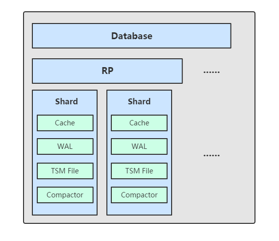

[toc]

#### LSM Tree

LSM Tree (Log-Structured Merge Tree) 即日志合并树，被用于大量的数据库引擎中，如Hbase、LevelDB等。适用于海量数据的写入，而查询少的情况。主要思想是随机写转化为顺序写。基本流程为，最新的数据驻留在磁盘中，等到积累到足够多之后，再内存中有序的数据合并追加到磁盘队尾。为了解决防止数据丢失，使用WAL(Write Ahead Log)方式，写入内存的同时写入文件，用来恢复内存中的数据。以 LevelDB 为例，内存 中的数据达到指定阀值后会在写入一个新的文件。当某一层的文件数超过一定值后，就会将该层下的一个文件和更高一级的文件合并，由于 文件数据都是有序的，相当于是一个多路归并排序，所以合并操作相当快速，最终生成一个新的 文件，将旧的文件删除，这样就完成了一次合并过程。这也大概是为什么叫Level的的原因吧。

这里推荐几篇优秀的LSM Tree文章

[1. LSM-Tree VS B-Tree](https://blog.bcmeng.com/post/lsm-tree-vs-b-tree.html#5-sstables-and-lsm-trees)

[2. 野猪书读书笔记第三章](https://xieyuanpeng.com/2018/10/18/野猪书读书笔记第三章/)

#### InfluxDB 存储架构

InfluxDB在经历了LSM Tree、B+Tree等几种尝试后，最终自研TSM，TSM全称是Time-Structured Merge Tree，思想类似LSM。我们先看它的整体架构：

##### 名词解释
1. Shard
上一篇文章中提到过这个概念，InfluxDB 中按照数据的时间戳所在的范围，会去创建不同的Shard Group，而Shard Group中会包含一个至多个Shard，单机版本中只有一个Shard。每一个 shard 都有自己的 cache、wal、tsm files 以及 compactor。
2.WAL
  wal 文件其作用就是为了防止系统崩溃导致的数据丢失。WAL是一种写优化的存储格式，允许持久写入，但不易于查询
2. Cache
  Cache是WAL中存储的数据的内存表示形式。达到一定阈值时与存储在TSM文件中的数据合并。
    ~~内存中暂存数据的地方，其实是一个map，key 为 seriesKey + FiledName，value为entry,具体实现为List<fieldkey,values>,values根据时间来排序。插入数据时，同时往 cache 与 wal 中写入数据，当Cache中的数据达到25M(默认)全部写入 tsm 文件。~~
3. TSM
4. Compactor

#### 文件目录介绍

Linux版本的数据文件位于`/var/lib/influxdb/`,Windows位于`C:/用户/.influxd/`下。主要有三个目录，分别是 meta, wal 以及 data 。meta 用于存储数据库的一些元数据，meta.db 文件。wal 目录存放预写日志文件，以 .wal 结尾。data 目录存放实际存储的数据文件，以 .tsm 结尾。整体结构如下所示：

```tree
influxdb/
  ├── data/
  |    └── [DB name]/
  |        └── [retention policy]/
  |        |    └── [shard group id]/
  |        |        ├── 000000001-0000000001.tsm
  |        |        └── fields.idx
  |        |		    └── index/
  |        |			      └── 0/
  |        |			          └── L0-000001.tsl 
  |        |			          └── MANIFEST
  |        |			      └── .../
  |        |			      └── 7/
  |        └── _series
  |            └──0/
  |              └──0000
  |            └──.../
  |            └──7/
  ├── meta/
  |    └── meta.db
  └── wal/
      └── [DB Name]/
          └── [retention policy]/ 
              └── [shard group id]/ 
                  └── _00001.wal
```

#### WAL
新的Ponit到来时，首先将被序列化，使用Snappy压缩并通过`fsync`写入WAL文件，然后在加入到内存中。一个WAL文件被称为一个 segment。写入文件的格式基于TLV(Type-length-value)标准。其中第一个字节代表条目的类型（写或删除），一个4字节uint32代表压缩块的长度，然后是压缩块。文件大小达到10M，则关闭才文件并开一个文件。当Cache中的数据写入TSM文件中后会删除对应的WAL文件。

#### Series File

_series目录保存了所有当前库下所有的Series key与Series ID的映射关系， ID<-> series key数据基于ID求余分区，分到8个目录中，在分区目录中在进行分文件存储，即超过256M就新开一个文件，防止文件过大。分区中的每个文件又称为Series segment。下面看segment的存储格式

|  Magic  | version | Entry | Entry | ...  |
| :-----: | :-----: | :---: | :---: | :--: |
| 4 bytes | 1 bytes |   N   |   N   | ...  |

Magic占4byte，固定值为`SSEG`，意思就是Series segment，主要看Entry结构。

|  Flag  | SeriesId |  Size   | MeasurementSize | Measurement | TagCount |  Tags  |
| :----: | :------: | :-----: | :-------------: | :---------: | :------: | :----: |
| 1 byte |  8 byte  | N bytes |     2 byte      |   N byte    |  N byte  | N byte |

Flag标记Series key是新加还是删除，SeriesId对应一个int64。Size表示Series key的长度，TagCount表示tag的数量。这里用了varint变长编码，Series key的长度基本上会小于127，因此这种编码压缩方式基本上只会占用一个字节，TagCount同理。Tags是由多个Tag组成，具体格式如下。

| Tag key size | tag key | Tag value size | tag value |
| :----------: | :-----: | :------------: | :-------: |
|   2 bytes    | N byte  |    2 bytes     |  N byte   |

当新的SeriesKey到来，根据`(ID-1)%8`分区追加到对应的分区文件中。同时内存中保留了索引， 每个分区对应两个map。

```go
keyIDMap    *rhh.HashMap // Series key到ID
idOffsetMap map[SeriesID]int64 // ID到Series key 在Series segment file中的坐标即索引信息
```

当然这两个map不会保存全部的key/value，当map中元素数量到达128k，将索引数据写入个Series Sement同目录下的Index文件，每一个分区都对应一个Index文件。

Index文件有三部分组成，分别是Header，OffsetIDBolck、IDOffsetBlock。


#### TSI 

默认配置下索引信息存放于内存中，`index-version="tsi1"`配置作用是将索引信息持久化至硬盘，TSI索引主要包含tsl、tsi文件，其实Series 文件也算。tsl、tsi文件位于在每个shard中`index`目录下。

##### TSL

##### TSI

当TSL文件大小达到配置的compaction阈值时（由配置文件中的max-index-log-file-size指定，默认为1M），TSL文件会compaction成TSI文件，TSI文件算是存储格式最为复杂的。

| Magic  | Tag Set Blocks | Measurement Block | SeriesID Set | TombstoneSeriesIDSet | SeriesSketch | TombstoneSketch | Trailer |
| :----: | :------------: | :---------------: | :----------: | :------------------: | ------------ | --------------- | ------- |
| 4 Byte |                |                   |              |                      |              |                 | 82 Byte |


#### TSM File 

Cache中的数据会不间断的写入TMS file，一个TSM文件由四个部分组成：head，block，index和Footer。
```
+--------+------------------------------------+-------------+--------------+
| Header |               Blocks               |    Index    |    Footer    |
|5 bytes |              N bytes               |   N bytes   |   4 bytes    |
+--------+------------------------------------+-------------+--------------+
```
Head用于标识文件类型和版本号。
```
+-------------------+
|      Header       |
+-------------------+
|  Magic  │ Version |
| 4 bytes │ 1 byte  |
+-------------------+
```
- Magic: 用于区分是哪一个存储引擎，目前使用的 tsm1 引擎，MagicNumber 为 0x16D116D1。
- Version (1 byte): 目前是 tsm1 引擎，此值固定为 1


Blocks 内部是一些连续的 Block，block 是 InfluxDB 中的最小读取对象，每次读取操作都会读取一个 block。每一个 Block 分为 CRC32 值和 Data 两部分，CRC32 值用于校验 Data 的内容是否有问题。Data 的长度记录在之后的 Index 部分中。
```
+--------------------------------------------------------------------+
│                           Blocks                                   │
+---------------------+-----------------------+----------------------+
|       Block 1       |        Block 2        |       Block N        |
+---------------------+-----------------------+----------------------+
|   CRC    |  Data    |    CRC    |   Data    |   CRC    |   Data    |
| 4 bytes  | N bytes  |  4 bytes  | N bytes   | 4 bytes  |  N bytes  |
+---------------------+-----------------------+----------------------+
```

每个block内存储的是某个TimeSeries的一段时间范围内的值，即某个时间段下measurement+tag set+field的值，Block内部会根据field的不同的值的类型采取不同的压缩策略，以达到最优的压缩效率。Block具体格式如下

```
+--------------------------------------------------------------------+
│                           Block                                    │
+-------------+----------------+----------------+------------+-------+
| 	  CRC		  | FieldValueType | TimeStamp Size | TimeStamps | values|
|   4 bytes   |      1 bytes   |       -		    | 			-    |    -	 |
+-------------+----------------+----------------+------------+-----=-+
```
- FieldValueType: 表示该DataBlock存储的FieldValue类型，InfluxDB中存在5中FieldValueType: Float, Integer, Unsigned, Boolean, String
- TimestampSize: 表示TimeStamps block的长度，使用可变长编码
- Timestamps: 将时间按列使用delta-delta编码压缩
- Values: 将FieldValue值按列进行压缩，不同类型的FieldValue使用不同的压缩算法


check block ？

Index是对Blocks的索引，首先按键顺序排列，然后按时间排序。key就是Series key + 分隔符 + Field name。每个Point有多个字段会在TSM文件中创建多个索引条目。

```
+-----------------------------------------------------------------------------+
│                                   Index                                     │
+-----------------------------------------------------------------------------+
│ Key Len │   Key   │ Type │ Count │Min Time │Max Time │ Offset │  Size  │....│
│ 2 bytes │ N bytes │1 byte│2 bytes│ 8 bytes │ 8 bytes │8 bytes │4 bytes │    │
+-----------------------------------------------------------------------------+
```

- **Key Len **:  key 的长度。
- **Key **: 这里的 key 指的是 Series Key + 分隔符 + fieldName。
- **Type**: Field Name 所对应的 FieldValue 的类型，也就是 Block 中 Data 内的数据的类型。
- **Count**: 后面 Blocks 索引的个数。
- **Min Time** : block 中 最小时间戳。
- **Max Time** : block 中最大时间戳。
- **Offset **: block 在整个 TSM File 中的偏移量。
- **Size **: block 的大小。根据 Offset + Size 字段就可以快速读取出一个 block 中的内容。

Footer用于存储索引起点的偏移量，方便将索引信息加载到内存中。

```
+---------+
│ Footer  │
+---------+
│Index Ofs│
│ 8 bytes │
+---------+
```

//TODO  间接索引？

#### InfluxDB存储总结